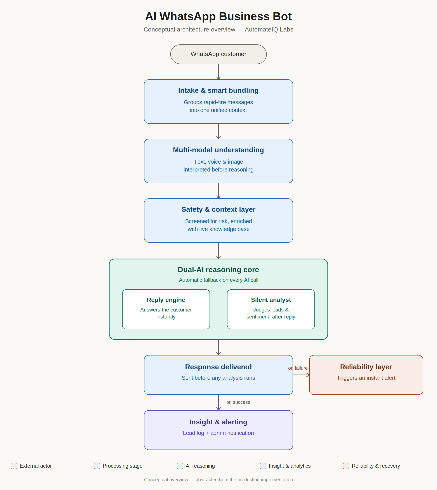

<!--
SEO keyword block (not rendered visually, indexed by search & LLM crawlers):
AI WhatsApp bot, WhatsApp Business Cloud API automation, n8n AI workflow, dual-AI fallback chatbot,
Google Gemini Groq fallback automation, multi-modal AI chatbot voice image, WhatsApp AI customer support Bangladesh,
production n8n automation case study, AI automation agency Bangladesh, AutomateIQ Labs, WhatsApp lead qualification bot,
self-hosted AI chatbot architecture, confidence-based AI reply system, prompt injection protected chatbot.
-->

# AI-Powered WhatsApp Business Bot — n8n Automation Case Study

**A production WhatsApp Business automation system with a dual-AI fallback core, multi-modal understanding (text, voice, image), and a self-healing reliability layer — built and deployed by AutomateIQ Labs.**

     

> 📌 **This is a conceptual case-study repository, not a rebuild guide.** It documents the design thinking, architectural principles, and problem-solving decisions behind a live production system. Exact node wiring, prompts, and configuration are intentionally not shown. See [License & Usage](#license--usage) below.

**Core keywords:** AI WhatsApp bot, n8n workflow automation, WhatsApp Cloud API chatbot, Gemini AI agent, Groq Llama fallback, conversational AI for business, WhatsApp automation Bangladesh, multi-modal AI chatbot, voice and image AI bot, AI automation agency Bangladesh.

---

## Table of Contents

- [Overview](#overview)
- [The Problem It Solves](#the-problem-it-solves)
- [Conceptual Architecture](#conceptual-architecture)
- [Design Principles](#design-principles)
- [Dual-AI Reasoning Model](#dual-ai-reasoning-model)
- [What Makes This Different From a Typical Chatbot](#what-makes-this-different-from-a-typical-chatbot)
- [Tech Stack](#tech-stack)
- [Reliability Philosophy](#reliability-philosophy)
- [FAQ](#faq)
- [License & Usage](#license--usage)
- [Connect](#connect)

---

## Overview

This repository documents a **universal WhatsApp Business bot** — a production automation system, self-hosted on n8n, designed to serve any business by swapping only its knowledge source and channel credentials, with zero changes to the underlying logic. It was built to handle real customer behavior — bursty messages, voice notes, images, provider outages — not just the clean single-message happy path most chatbot demos show.

## The Problem It Solves

Most "AI chatbot" builds handle one message in, one reply out, and fall over the moment real-world usage gets messy:

- Customers send several messages back-to-back, expecting one coherent reply, not three disjointed ones
- Customers send voice notes and photos, not just typed text
- AI providers occasionally rate-limit or go down mid-conversation
- A failed reply, if nobody notices, quietly loses a customer

This system was engineered specifically around those failure modes, not just the ideal case.

## Conceptual Architecture

This diagram shows the **conceptual flow only** — six logical stages, not the actual node graph. The production workflow is significantly more granular (tens of nodes across each stage, with branching, retries, and state management not represented here) — that level of detail is intentionally withheld; see [License & Usage](#license--usage).

## Design Principles

- **Bundle before you reason.** Multiple messages arriving in a short window are merged into one context before any AI call — the bot never replies mid-thought.
- **Understand before you reject.** Voice and image input are interpreted, not just accepted-or-declined — but only validated content reaches the reasoning layer.
- **Never go silent.** Every AI-dependent step has a fallback model, so one provider's downtime doesn't take the whole bot down.
- **Reply first, analyze second.** The customer-facing response is never delayed by internal analytics or lead-scoring — those run afterward, independently.
- **A failed reply is an emergency, not a log entry.** If a message can't be delivered, that's treated as more urgent than any other event in the system.

## Dual-AI Reasoning Model

The system separates **talking to the customer** from **judging the conversation** into two independent AI roles, so neither responsibility compromises the other.

|                     | Reply Engine                          | Silent Analyst                                  |
| ------------------- | -------------------------------------- | ------------------------------------------------ |
| **Job**             | Generate the customer-facing response  | Judge lead strength, sentiment, and admin need    |
| **Visible to user** | Yes                                     | No — runs quietly after the reply is sent         |
| **Failure handling** | Automatic fallback to a secondary model | Automatic fallback to a secondary model           |

## What Makes This Different From a Typical Chatbot

- 🧠 **Business-agnostic core** — the same logic serves any client; only the knowledge source and channel credentials change
- 💬 **Context-aware message bundling** — bursts of messages are understood as one thought, not several
- 🎙️🖼️ **True multi-modal input** — voice and images are interpreted, not just passed through or rejected
- 🔁 **Fallback on every AI call** — no single point of AI failure
- 🛡️ **Built-in safety screening** — inbound and outbound content is checked before it reaches the customer or the model
- 🧯 **Dedicated failure-alerting path** — delivery failures are escalated immediately, independent of normal analytics

## Tech Stack

| Category            | Technology                                  |
| -------------------- | -------------------------------------------- |
| Automation Engine     | n8n (self-hosted)                            |
| Messaging Platform    | WhatsApp Business Cloud API                  |
| Primary AI            | Google Gemini 2.5 Flash                      |
| Fallback AI            | Groq (Llama family — reasoning, vision, transcription) |
| Session/Bundling State | Redis                                        |
| Knowledge Source        | Cloud document store                        |
| Insights & Alerting      | Spreadsheet logging + Telegram notifications |

## Reliability Philosophy

If a reply fails to reach the customer, the system treats that as the highest-priority event it can encounter — higher priority than completing any background analytics for that message. A dedicated recovery path exists solely to catch this case and get a human alerted immediately, rather than letting a failure sit unnoticed in a log file.

## FAQ

**What AI models power this system?** Google Gemini 2.5 Flash as the primary model, with Groq's Llama model family as an automatic fallback across every AI-dependent step — including reasoning, vision, and voice transcription.

**How does it handle a burst of messages?** Incoming messages within a short window are merged into a single context before the AI responds, instead of generating a separate, disjointed reply to each one.

**Does it actually understand voice notes and photos?** Yes — both are analyzed and classified before being incorporated into the reply logic, rather than being treated as unsupported input.

**Can I get the exact workflow to deploy myself?** No — this repository is a conceptual case study, not a deployment package. See [License & Usage](#license--usage) below, or reach out about a custom build.

**Is this open source?** No. See [License & Usage](#license--usage).

## License & Usage

This repository is published under an **all-rights-reserved proprietary license** — see [`LICENSE`](./LICENSE). It exists to demonstrate architecture and engineering decisions, not to serve as a rebuild guide. Copying, reproducing, or using this design to construct the same or a substantially similar system is not permitted without written consent.

If you're a business or agency interested in a similar system built for you, reach out below.

## Connect

**Muhammad Antor** — AI Automation Engineer & Founder, AutomateIQ Labs 🇧🇩

- LinkedIn: [linkedin.com/in/muhammad-antor](https://www.linkedin.com/in/muhammad-antor)
- Facebook (AutomateIQ Labs): [facebook.com/automateiq.labs](https://www.facebook.com/automateiq.labs/)
- GitHub: [github.com/muhammadantor](https://github.com/muhammadantor)
- Email: [muhammadantor71@gmail.com](mailto:muhammadantor71@gmail.com)

---

Documentation repository by AutomateIQ Labs — architecture and design decisions shared for portfolio purposes; the underlying implementation is proprietary and not licensed for reuse.
